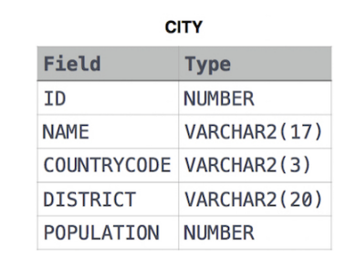

**[ENG]**

Query all columns for all American cities in the CITY table with populations larger than 100000. The CountryCode for America is USA.

The CITY table is described as follows:




**SOLUCIÓN**

```sql

SELECT
    *
FROM
    CITY
WHERE 
    -- 1era condición
    population > 100000 AND

    -- 2da condición  
    countrycode = 'USA';

```


**output:**


````
3878 Scottsdale USA Arizona 202705 
3965 Corona USA California 124966 
3973 Concord USA California 121780 
3977 Cedar Rapids USA Iowa 120758 
3982 Coral Springs USA Florida 117549 

```