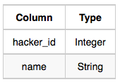
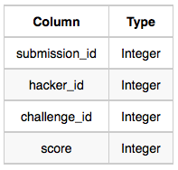

# Contest Leaderboard

You did such a great job helping Julia with her last coding contest challenge that she wants you to work on this one, too!

The total score of a hacker is the sum of their maximum scores for all of the challenges. Write a query to print the **hacker_id**, **name**, and **total score** of the hackers ordered by the descending score. If more than one hacker achieved the same total score, then sort the result by ascending **hacker_id**. Exclude all hackers with a total score of 0 from your result. :contentReference[oaicite:1]{index=1}

## Input Format

The following tables contain contest data:

- **Hackers**: The `hacker_id` is the id of the hacker, and `name` is the name of the hacker. :contentReference[oaicite:2]{index=2}





- **Submissions**: The `submission_id` is the id of the submission, `hacker_id` is the id of the hacker who made the submission, `challenge_id` is the id of the challenge for which the submission belongs to, and `score` is the score of the submission. :contentReference[oaicite:3]{index=3}



# RESPUESTA
```sql

WITH maximo_por_challenge AS (
    SELECT
        hacker_id,
        challenge_id,
        MAX(score) AS max_score
    FROM Submissions
    GROUP BY hacker_id, challenge_id
),
totales AS (
    SELECT
        hacker_id,
        SUM(max_score) AS total_score
    FROM maximo_por_challenge
    GROUP BY hacker_id
)
SELECT
    t.hacker_id,
    h.name,
    t.total_score
FROM totales t
JOIN Hackers h
  ON h.hacker_id = t.hacker_id
WHERE t.total_score > 0
ORDER BY
    t.total_score DESC,
    t.hacker_id ASC;


```
