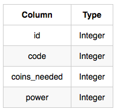
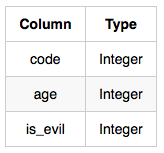

**[ENG]**
Harry Potter and his friends are at Ollivander's with Ron, finally replacing Charlie's old broken wand.

Hermione decides the best way to choose is by determining the minimum number of gold galleons needed to buy each non-evil wand of high power and age. Write a query to print the id, age, coins_needed, and power of the wands that Ron's interested in, sorted in order of descending power. If more than one wand has same power, sort the result in order of descending age.


Wands: The id is the id of the wand, code is the code of the wand, coins_needed is the total number of gold galleons needed to buy the wand, and power denotes the quality of the wand (the higher the power, the better the wand is).




Wands_Property: The code is the code of the wand, age is the age of the wand, and is_evil denotes whether the wand is good for the dark arts. If the value of is_evil is 0, it means that the wand is not evil. The mapping between code and age is one-one, meaning that if there are two pairs,  and , then  and .


**SOLUCIÓN**

```sql

SELECT 
    w.id, 
    p.age, 
    w.coins_needed, 
    w.power
FROM wands w
JOIN wands_property p ON w.code = p.code
WHERE p.is_evil = 0
  AND w.coins_needed = (
      SELECT MIN(coins_needed)
      FROM wands w1
      JOIN wands_property p1 ON w1.code = p1.code
      WHERE w1.power = w.power 
        AND p1.age = p.age
  )
ORDER BY 
    w.power DESC, 
    p.age DESC;


````


**output:**


````


```