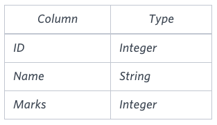
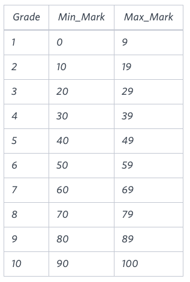

# The Report

You are given two tables: **Students** and **Grades**.  

**Students** contains three columns: `ID`, `Name` and `Marks`.  



**Grades** contains the following data:




Ketty gives Eve a task to generate a report containing three columns: **Name**, **Grade** and **Mark**. Ketty doesn't want the **NAMES** of those students who received a grade lower than 8.  

The report must be in **descending order by grade** — i.e., higher grades are entered first. If there is more than one student with the same grade (8–10) assigned to them, order those particular students **by their name alphabetically**.

Finally, if the grade is lower than 8, use `"NULL"` as their name and list them **by their grades in descending order**. If there is more than one student with the same grade (1–7) assigned to them, **order those particular students by their marks in ascending order**.

Write a query to help Eve.


# Respuesta


```sql

SELECT
    CASE WHEN GRADES.GRADE<8 THEN 'NULL' ELSE STUDENTS.Name END AS Name, 
    GRADES.GRADE,
    STUDENTS.Marks
FROM
    STUDENTS
JOIN 
    GRADES ON STUDENTS.Marks BETWEEN GRADES.Min_mark AND GRADES.Max_mark
ORDER BY GRADES.GRADE DESC, (CASE WHEN GRADES.Grade >= 8 THEN STUDENTS.Name END) ASC, 
         (CASE WHEN GRADES.Grade < 8 THEN STUDENTS.Marks END) ASC;

```
