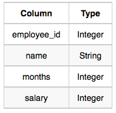

**[ENG]**

Write a query that prints a list of employee names (i.e.: the name attribute) for employees in Employee having a salary greater than  2000 per month who have been employees for less than  10 months. Sort your result by ascending employee_id.

**[ESP]**  
Escribe una consulta que imprima una lista de nombres de empleados (es decir, el atributo name) para aquellos empleados en la tabla Employee que tienen un salario mayor a 2000 por mes y que han sido empleados por menos de 10 meses. Ordena tu resultado por employee_id en orden ascendente.




**SOLUCIÓN**

```sql


SELECT
    name
FROM 
    employee
WHERE 
    salary > 2000 AND 
    months < 10
ORDER BY
    employee_id ASC;

```


**output:**


````
Rose 
Patrick 
Lisa 
Amy 
Pamela 
Jennifer 
Julia 
Kevin 
Paul 
Donna 
Michelle 
Christina 


```