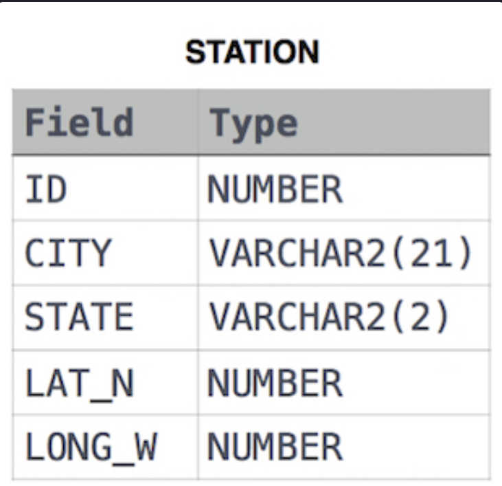

**[ENG]**

Query the list of CITY names starting with vowels (i.e., a, e, i, o, or u) from STATION. Your result cannot contain duplicates.



**SOLUCIÓN**

```sql


SELECT
    city
FROM
    station
WHERE 
    lower(city) LIKE 'a%' or
    lower(city) LIKE 'e%' or
    lower(city) LIKE 'i%' or 
    lower(city) LIKE 'o%' or 
    lower(city) LIKE 'u%';


```


**output:**


````

Acme 
Addison 
Agency 
Aguanga 
Alanson 
Alba 
Albany 
Albion 
Algonac 
Aliso Viejo 
Allerton 
Alpine 
Alton 
Amazonia 
Amo 
Andersonville 
Andover 
Anthony 
Archie 
Arispe {-truncated-}


```